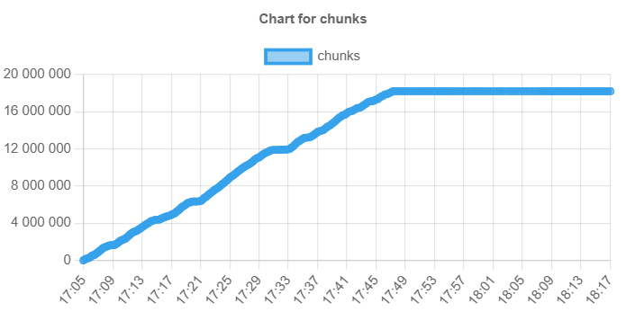
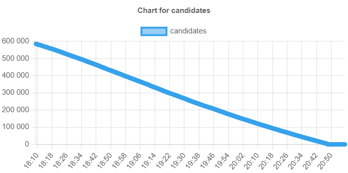

# All at once clone detector
1. I was able to process the entire of the Corpus in ca 4 hours. If I were to guess what the fault could be had I crashed then I would lean towards memory overload. With a chunksize of 20 we need to indentify 18 milion clones. That is quit a lot of space and most of it will be in ram during the processing. But this is just a guess from observing my own computer during the processing. 
2. 
    - From the graph generated by the monitoring software we can see a linear behavior in the identification of the chunks.  This is the expected behavior as once we start indentifying chunks we need to compare them to the other chunks to find out if it is a new chunk or a copy of an already identified one. 
    - Sadly I do not have the data for how long exactly it took to create the candidates however based on when the last chunks was created and all the first entry for the candidates was we get a time of ca 25 min. Then the candidates are consumed as they are converted into clones.  We can note however that they are consumed in a linear fashion. 